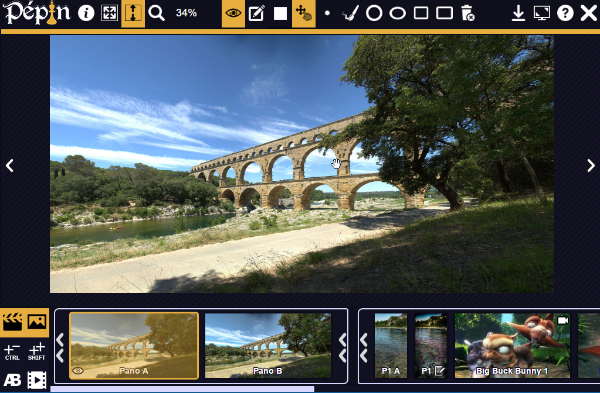
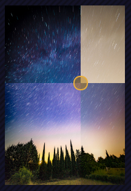
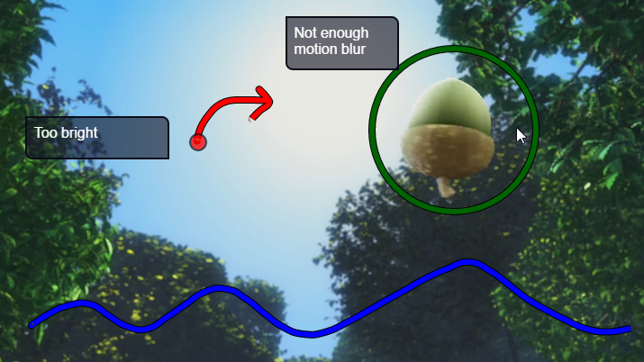
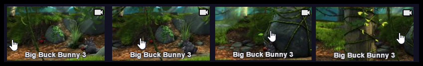
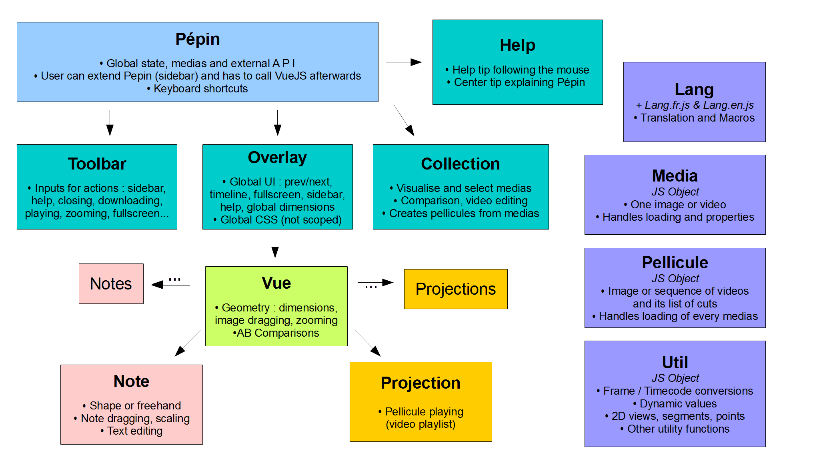

# Pépin Media Player
## Key features

Pépin (*Pépin est un Espace de Prévisualisation IntraNet*) is a full-featured web-based image and video player. It was designed for AV professionals at [TAT Studio](http://tatprod.com/en/), an animation studio based in Toulouse, France.

Key features are :

 * **Displaying** : easy zoom and pan, media automatically fitting the available space, fullscreen, good display of very wide and very tall images ;
 * Multiple **medias comparison** by overlapping (A) ;
 * **Video features** : frame accurate seeking, gapless video playlist imitating the output of a video editing software (B), looping, controls for playback rate  ;
 * **Annotations** : graphical and/or textual notes, including basic shapes and freehand drawing with Bézier curves (C), annotations can be put on a video at a given frame ;
 * **Keyboard shortcuts** for every action.

## Online demo

Online demo at <a href="http://dornstetter.com/antoine/pepin/">http://dornstetter.com/antoine/pepin/</a>. Wait for medias downloading.
 
## User interface
Pépin UI includes :
 
 * A top toolbar to access all the features ;
 * The list of medias at the bottom, with filtering by type, group selection, media folders, buttons for comparison and video playlist ;
 * A customizable sidebar at the left ;
 * A help tip in English or French to explain every feature and its shortcut (button ? in the toolbar) ;
 * A central area with the media, its name, a top slider for 1D Lock and a bottom timeline for videos.

## Screenshots

(A) Media comparison example with different photo processing (top right is raw photo) :



(B) Gapless video playlist example with 4 sequences of Big Buck Bunny :



(C) Example of annotations with text, a circle, freehand drawings, a point and different colors :



# H.264 Frame Accurate Seeking Issue

My research were focused on trying to get every frame out of H.264 mp4 file with Firefox and Chrome. I have found that you have to encode the video without [Bipredictive frames](https://en.wikipedia.org/wiki/Inter_frame#B-frame). Theses are the frames that disappears when the video is paused and the video scrubbed (modifying the  `currentTime`  variable).


You can encode with ffmpeg and  `libx264 `  with the  ` -bf 0` argument in order to remove B-Frames.

# Installing and Coding

Pépin on the client side uses [VueJS v1.0](https://vuejs.org/), jQuery and [screenfull](https://github.com/sindresorhus/screenfull.js/).

Pépin back-end is based on the [webpack vue-js boilerplate](https://vuejs-templates.github.io/webpack/).

Install dependencies with `npm install` before running one of theses two commands :

## `npm run dev`

Serves `index.html5` on `localhost:8000` 

## `npm run build`

Builds the dist folder with javascript compiled, css, images (some are minified into the CSS), and static javascript libraries.

## `filmStrip.py` Script

This script is useful for creating video thumbnails in Pépin :



You need to install Python, Pillow (`pip install Pillow`) and ffmpeg / ffprobe in order to use this script.

Example of command line to use this script : `python filmStrip.py --video "your_video.mp4" --output "your_video_thumb.jpg"`

## FYI : Pepin object diagram
To understand what every file is about :



# Using in a web page
An example of using Pépin is given in `index.html5`, with sidebar's content customized.

## Setup
First include in your HTML JS libraries and CSS :
```
    <script type="text/javascript" src="pepin/lib/jquery.js"></script>
    <script type="text/javascript" src="pepin/lib/jquery.easing.1.3.js"></script>
    <script type="text/javascript" src="pepin/lib/jquery.mousewheel.js"></script>
    <script type="text/javascript" src="pepin/lib/screenfull.js"></script>
    <script type="text/javascript" src="pepin/manifest.js"></script>
    <script type="text/javascript" src="pepin/vendor.js"></script>
    <script type="text/javascript" src="pepin/app.js"></script></body>
    <link href="pepin/app.[hash].css" rel="stylesheet" />
```

The function `CreatePepinObject(obj)` is automatically added to `window.Pepin.default`.

`obj` has 4 properties :

 * `$` and `screenfull` : jQuery and `screenfull.js` dependencies injection ;
 * `pepinElement` : CSS selector to find the main pepin node ;
 * `props` : VueJS props useful if you want to customize the sidebar.

This function returns an object that you can modify if you want to customize the sidebar or respond to Pepin events. You have to give this object to VueJS, automatically added to `window.Pepin.default`, for example :

```
var Pepin = Pepin.default.Vue(Pepin.default.CreatePepinObject({
    pepinElement : '#pepin',
    '$' : jQuery,
    screenfull : screenfull,
    props: [],
});
```

## API

Pepin's methods are :

 * `sidebarClose` / `sidebarOpen` ;
 * 

## Known bugs

 * AB Comparison not working with Firefox on medias hosted online (works with media on localhost or file://)

## Todo

 * Upgrade to VueJS 2.1
 
# Future

Interesting features to be added are :

 * A more complete API and external events ;
 * 3D Models inspection and annotation with WebGL ;
 * Being able to include parts of Pépin in a windowed part of the page (and not the whole document) ;
 * Popular CMS plugins ;
 * Handling gigapixel photos ;
 * Image and video color filters.
 
# Credits and license

Pépin is licensed with the [GNU Lesser General Public License LGPL](https://opensource.org/licenses/LGPL-3.0).

Pépin was developed by [Antoine Dornstetter](http://dornstetter.com/antoine/), as part of its end-of-studies internship at [TAT Studio](http://tatprod.com/en/) from April to September 2016. Thanks to Stéphane Margail, Laurent Chea and Romain Teyssonnière.

<a href="http://tatprod.com/en/">
</a>