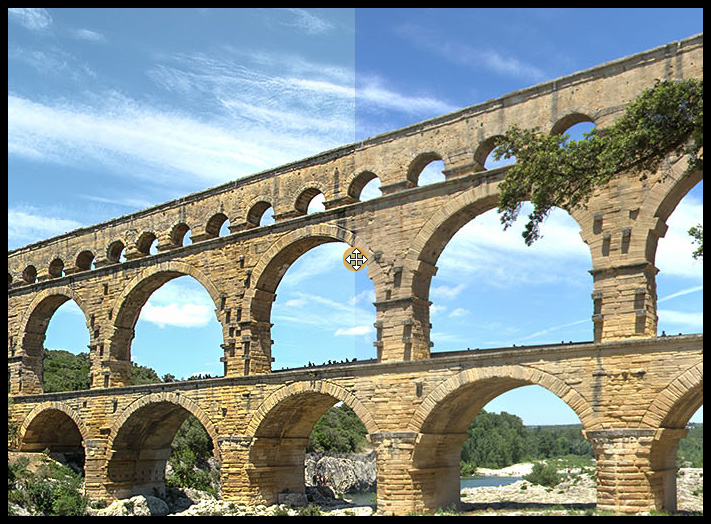
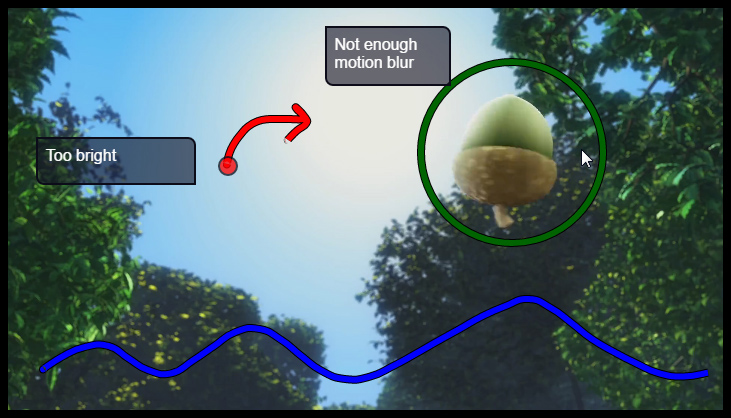

# Pépin Media Player
## Key features

Pépin (*Pépin est un Espace de Prévisualisation IntraNet*) is a full-featured web-based image and video player. It was designed for AV professionals at [TAT Studio](http://tatprod.com/en/), an animation studio based in Toulouse, France.

Key features are :

 * **Displaying** : easy pan and exponential zoom, fullscreen, media automatically fitting the available space, good display of very wide and very tall images ;
 * Multiple **medias comparison** by overlapping (Screenshot B) ;
 * **Video features** : frame-accurate seeking & scrubbing, gapless video playlist imitating the output of a video editing software (Screenshot C), looping, controls for playback rate ;
 * **Annotations** : graphical and/or textual notes, including basic shapes and freehand drawing with Bézier curves (Screenshot D), annotations can be put on a video at a given frame ;
 * **Keyboard shortcuts** for every action.

Pépin was mainly designed for its video features, allowing comparisons between different output, playback of a sequence of videos directly in the browser (without using a video editing software) and frame-by-frame inspection.

Some of theses features can be found in video review projects like [frame.io](https://frame.io/), [shotgun](https://www.shotgunsoftware.com/) or [wipster](https://wipster.io/). Solutions rarely provide frame-accurate scrubbing.

## Online demo

Online demo at <a href="http://dornstetter.com/antoine/pepin/">http://dornstetter.com/antoine/pepin/</a>. Wait for medias to download.
 
Pépin was tested on Firefox and Chrome.

## Screenshots

(A) Overall appearance  :


(B) Media comparison example :




This feature also works with videos on Firefox and sometimes Chrome.

(C) Gapless video playlist example with 4 sequences of Big Buck Bunny :


(D) Example of annotations with text, a circle, freehand drawings, a point and different colors :



## User interface
Pépin UI includes :
 
 * A top toolbar to access all the features ;
 * The list of medias at the bottom, with left buttons for filtering by type, group selection, media folders, medias comparison and video playlist (first click these buttons and then select medias for comparison or playlist) ;
 * A customizable sidebar at the left ;
 * A help tip in English or French to explain every feature and its shortcut (button ? in the toolbar) ;
 * A central area with the media, its name, a top slider for 1D Lock and a bottom timeline for videos.

## H.264 Frame Accurate Seeking Issue
My research were focused on trying to get every frame out of H.264 mp4 file. I have found that you have to encode the video without [Bipredictive frames](https://en.wikipedia.org/wiki/Inter_frame#B-frame). Theses are the frames that disappears when the video is paused and the video scrubbed (modifying the  `currentTime`  variable when video is paused), both with Firefox and Chrome.


You can encode with ffmpeg and `libx264 ` with the ` -bf 0` argument in order to remove B-Frames.

Note : There is no way to know *for sure* which frame is displayed by the browser video plugin.

To do : create a script that produces a video with enough data in each frame to ID them, create a web page that test if every frame of the video file can be accessed.

# Using and Coding

Pépin on the client side uses [VueJS v1.0](https://vuejs.org/), jQuery and [screenfull](https://github.com/sindresorhus/screenfull.js/).

Pépin back-end is based on the [webpack vue-js boilerplate](https://vuejs-templates.github.io/webpack/).

Install dependencies with `npm install` before running one of theses two commands :

## `npm run dev`

Serves `index.html5` on `localhost:8080` 

## `npm run build`

Builds the dist folder with javascript compiled, css, images (some are minified into the CSS), and static javascript libraries.

## `filmStrip.py` Script

This script is useful for creating video thumbnails in Pépin :


You need to install Python, Pillow (`pip install Pillow`) and ffmpeg / ffprobe in order to use this script.

Example of command line to use this script : `python filmStrip.py --video "your_video.mp4" --output "your_video_thumb.jpg"`

## FYI : Pepin object diagram
To understand what every file is about :


## Setup
An example of using Pépin is given in `index.html5`, with sidebar's content customized.

First include in your HTML JS libraries and CSS :
```
    <script type="text/javascript" src="pepin/lib/jquery.js"></script>
    <script type="text/javascript" src="pepin/lib/jquery.easing.1.3.js"></script>
    <script type="text/javascript" src="pepin/lib/jquery.mousewheel.js"></script>
    <script type="text/javascript" src="pepin/lib/screenfull.js"></script>
    <script type="text/javascript" src="pepin/manifest.js"></script>
    <script type="text/javascript" src="pepin/vendor.js"></script>
    <script type="text/javascript" src="pepin/app.js"></script></body>
    <link href="pepin/app.[hash].css" rel="stylesheet" />
```

`CreatePepinObject(obj)` function is automatically added to `window.Pepin.default`.

`obj` has 4 properties :

 * `$` and `screenfull` : jQuery and `screenfull.js` dependencies injection ;
 * `pepinElement` : CSS selector to find the main pepin node ;
 * `medias` : array of Medias object `{ Name , URL , ThumbnailURL , Type , ID [ , Group , Notes ] }`.

This function returns an object that you can modify if you want to customize the sidebar or respond to some Pepin events. You have to give this object back to VueJS, automatically added to `window.Pepin.default`. See code and `index.html5` for more information.

## To do

 * Upgrade to VueJS 2.1 ;
 * Finish API ;
 * Less jQuery ;
 * More documentation ;
 * Remove `v-if` and `v-for` on the same elements (vuejs warnings) ;
 * No main framerate value, but each video has its own fps (lots of changes in Pellicule).
 
# Future

Interesting features to be added are :

 * A more complete API and external events ;
 * 3D Models inspection and annotation with WebGL ? Shaders comparison ? ;
 * Being able to include parts of Pépin in a windowed part of the page (and not the whole document) ;
 * Popular CMS integration plugins ;
 * Handling gigapixel photos ;
 * More comparisons modes (side-by-side for example) ;
 * A color picker for notes color in the toolbar ;
 * CSS filters.
 
# Credits and license

Pépin is licensed with the [GNU Lesser General Public License LGPL](https://opensource.org/licenses/LGPL-3.0).

Do not use in production.

Pépin was developed by [Antoine Dornstetter](http://dornstetter.com/antoine/), as part of its end-of-studies internship at [TAT Studio](http://tatprod.com/en/) from April to September 2016. Thanks to Stéphane Margail, Laurent Chea and Romain Teyssonnière.

<a href="http://tatprod.com/en/">
</a>
